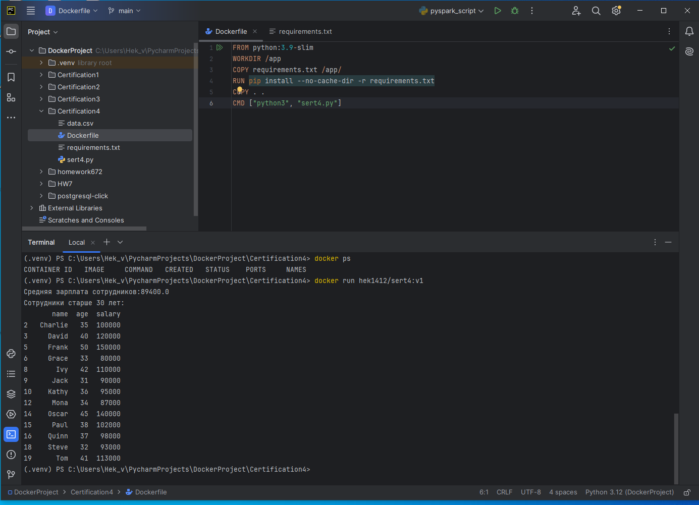

# certification 4 1T (DevOps)
## Задание 4. Создание Docker-контейнера с Pandas
### Docker-контейнер с Python-приложением, которое выполняет анализ данных с использованием библиотеки Pandas.

Создаем директорию для проекта и необходимые файлы:

1) dockerfile:
```
FROM python:3.9-slim
WORKDIR /app
COPY requirements.txt /app/
RUN pip install --no-cache-dir -r requirements.txt
COPY . .
CMD ["python3", "sert4.py"]
```

2) sert4.py
```
import pandas as pd

df = pd.read_csv('data.csv')

average_salary = df[['salary']].mean().item() # Вычисляем среднюю зп
print(f"Средняя зарплата сотрудников:{average_salary}")

age = df[df['age'] > 30] # Вычисляем у кого возраст старше 30 лет
print("Сотрудники старше 30 лет:")
print(age)
```

3) requirements.txt
```
pandas
```

4) data.csv
```
name,age,salary
Alice,30,70000
Bob,25,50000
Charlie,35,100000
David,40,120000
Eve,28,60000
Frank,50,150000
Grace,33,80000
Hank,29,55000
Ivy,42,110000
Jack,31,90000
Kathy,36,95000
Leo,24,48000
Mona,34,87000
Nina,26,65000
Oscar,45,140000
Paul,38,102000
Quinn,37,98000
Rachel,27,62000
Steve,32,93000
Tom,41,113000
```

Отлично, теперь  `docker build -t hek1412/sert4:v1 .` и соответственно запускаем ` docker run hek1412/sert4:v1`

Наблюдаем, желаемый результат)))


